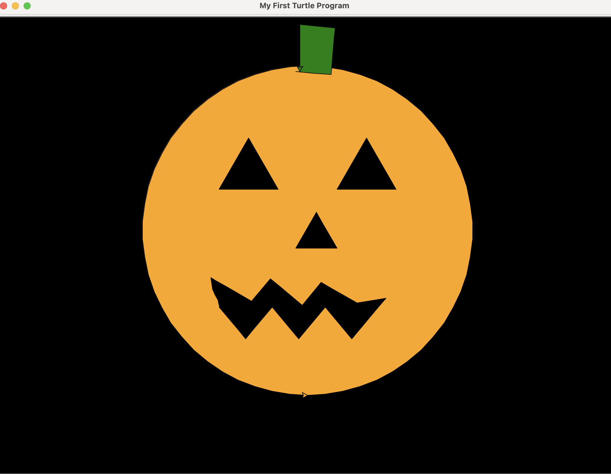

# Having fun with Python Turtle

Developed in 1967, Logo was one of the first educational programming languages. With its simple concept of commanding a turtle to move around the screen to construct line graphics, it became a staple in school computer labs (along with the Oregon Trail). While Logo has given way to more advanced computer science education tool such as Scratch, Lego Mindstorm, and Minecraft, it lives on in the Python Turtle package.

https://realpython.com/beginners-guide-python-turtle

Help with turtle coordinates: https://runestone.academy/ns/books/published/welcomecs/CSPNameTurtles/turtleCoordinates.html
